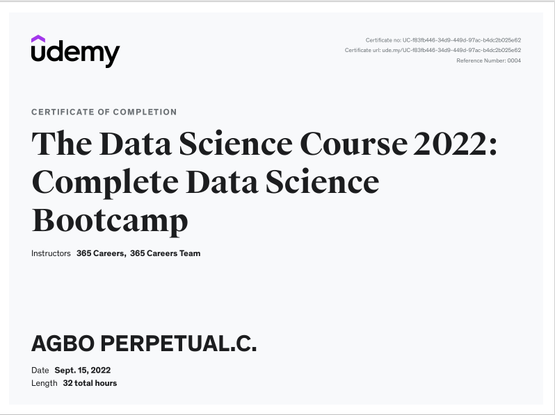
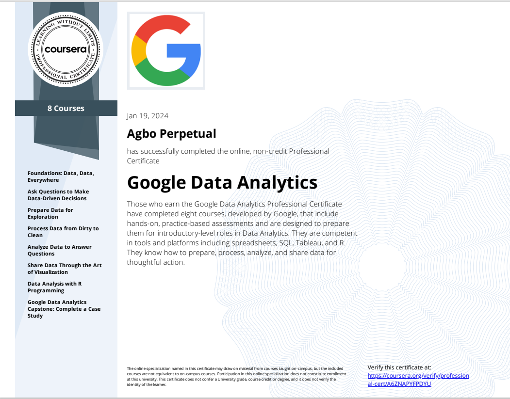
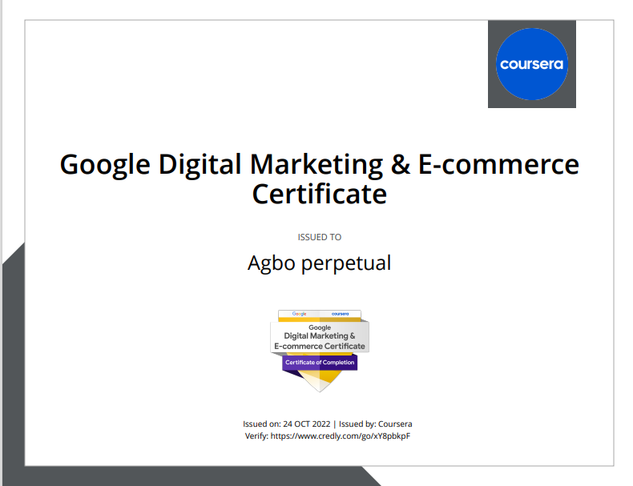

# DATA ANALYST

## 🎓 Education

### Data Science Certification, Udemy 2022      

Curriculum: Comprehensive training in data analysis, machine learning and data visualization.

  

### Google Data analytics Certification, Coursera 2023 

Curriculum: Data Collection, data cleaning with excel and SQL, analyzing data with R programming, Data visualization       using excel, Tableau and R. Completed hands-on project using real world data.

  

### Microsoft Scholarship program on Power Platform 2023
Curriculum: Creating PowerApps using real life data, data analysis and visualization using Power BI, automate a business process using power automate, creating of web power pages using the power page platform.

### Digital Marketing Certification, Google Scholarship Program on Coursera 2022 

Curriculum: Fundamentals in Digital Marketing, Marketing analytics and measurement, Email Marketing

  

 # contacts 
 

